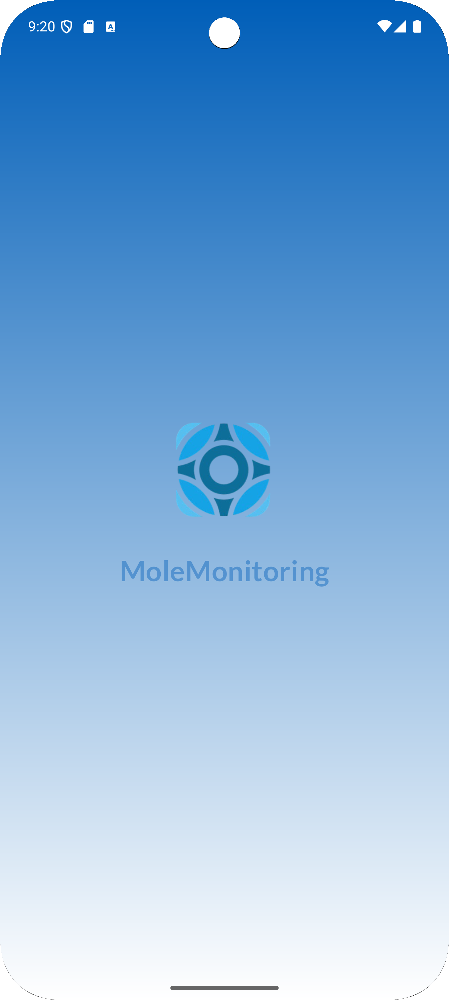
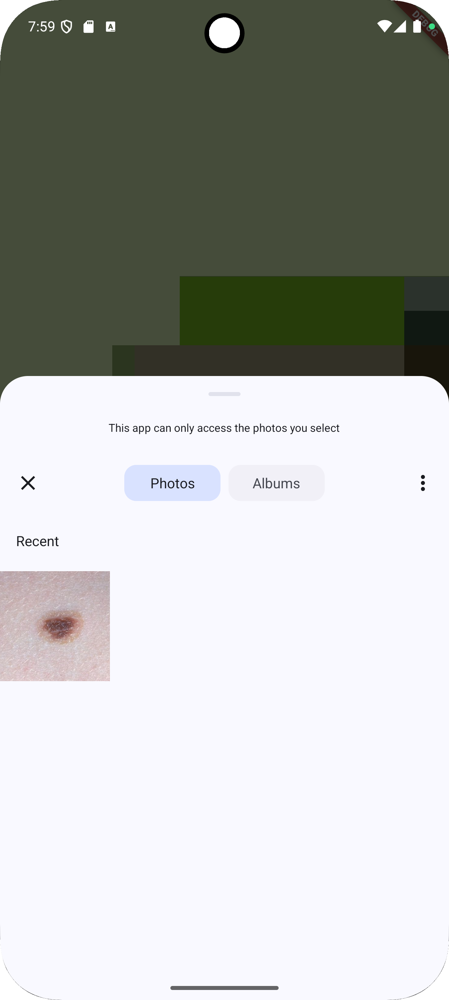
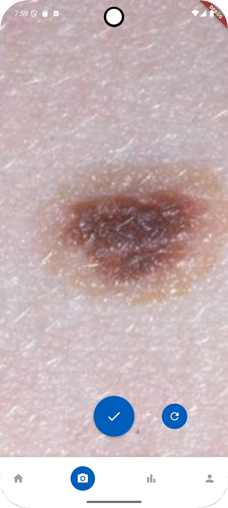
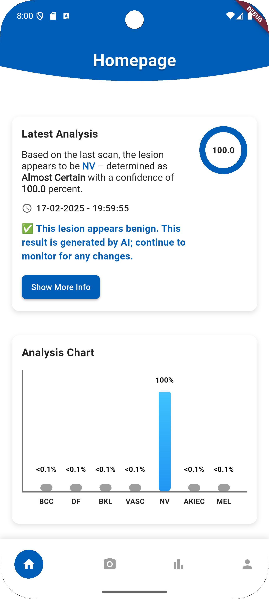
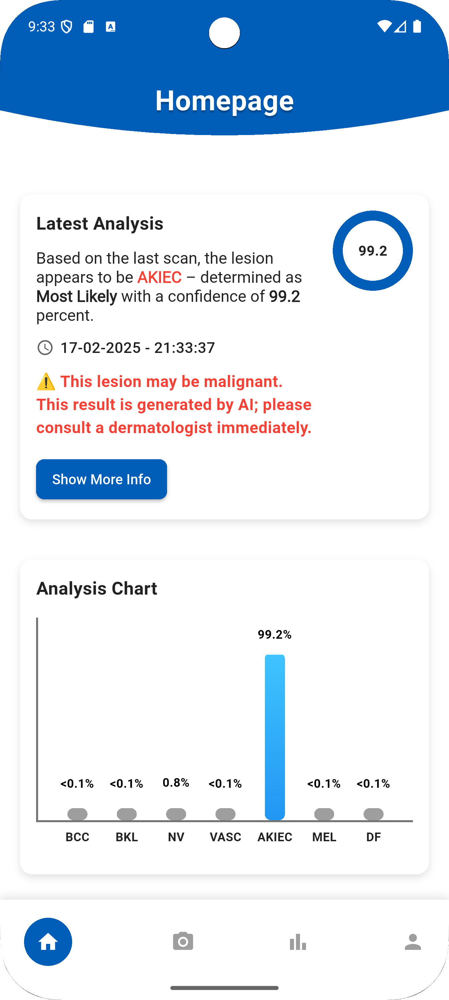

# MoleMonitoring: Skin Mole Classification
**MoleMonitoring** is a deep learning project from the **Samsung Innovation Campus**, focused on classifying skin moles using dermoscopic images. Our best model, **Fusion Model + SVM**, achieved **91% accuracy** on **HAM10000** and **83% accuracy** on **ISIC2018**, outperforming baseline models like ResNet-50.

## MoleMonitoring Pipeline Overview

<div align="center">
  <table style="border-collapse: collapse; border: none;">
    <!-- Top row (3 images) -->
    <tr style="border: none;">
      <td align="center" style="border: none; padding: 10px;">
        
        <div style="margin-top:8px; font-weight:bold;">1. Beginning</div>
      </td>
      <td align="center" style="border: none; padding: 10px;">
        
        <div style="margin-top:8px; font-weight:bold;">2. Empty</div>
      </td>
      <td align="center" style="border: none; padding: 10px;">
        
        <div style="margin-top:8px; font-weight:bold;">3. Gallery</div>
      </td>
    </tr>
    <!-- Bottom row (3 images) -->
    <tr style="border: none;">
      <td align="center" style="border: none; padding: 10px;">
        
        <div style="margin-top:8px; font-weight:bold;">4. Analyze Mole</div>
      </td>
      <td align="center" style="border: none; padding: 10px;">
        
        <div style="margin-top:8px; font-weight:bold;">5. View Results</div>
      </td>
      <td align="center" style="border: none; padding: 10px;">
        
        <div style="margin-top:8px; font-weight:bold;">6. Example Malignant</div>
      </td>
    </tr>
  </table>
</div>


## Team Members:

- **Manuel Pinto** - [GitHub: ManuelCPinto](https://github.com/ManuelCPinto)  
- **André Branco** - [GitHub: Aser28860d](https://github.com/Aser28860d)  
- **Francisco Silva** - [GitHub: fpgsilva](https://github.com/fpgsilva)  
- **João Pedro Silveira** - [GitHub: Joao-Pedro-Silveira](https://github.com/Joao-Pedro-Silveira)  

The HAM10000 dataset includes the following seven classes of skin lesions, categorized into **Benign** and **Malignant**:
### **Malignant Lesions**
- **Actinic Keratoses (`akiec`)**  
  Precancerous skin lesions that may develop into squamous cell carcinoma.

- **Basal Cell Carcinoma (`bcc`)**  
  A common and slow-growing type of skin cancer that rarely spreads.

- **Melanoma (`mel`)**  
  An aggressive and potentially fatal form of skin cancer that develops in melanocytes.
  
### **Benign Lesions**
- **Benign Keratosis-like Lesions (`bkl`)**  
  Non-cancerous growths, including seborrheic keratoses and solar lentigines.

- **Dermatofibroma (`df`)**  
  Small, firm nodules that are benign skin tumors.

- **Melanocytic Nevi (`nv`)**  
  Commonly known as moles or beauty marks, these are benign accumulations of melanocytes.

- **Vascular Lesions (`vasc`)**  
  Benign abnormalities of blood vessels, such as hemangiomas or angiomas.
  
## Dataset Preparation

Follow these steps to download and prepare the HAM10000 dataset for this project:

### 1. Download the Dataset
1. Visit the [HAM10000 dataset page](https://dataverse.harvard.edu/dataset.xhtml?persistentId=doi:10.7910/DVN/DBW86T).
2. Download the file named **`dataverse_files.zip`**.
3. Place the downloaded file in the root directory of the project.

### 2. Run the Preprocessing Scripts
1. Run the following commands on the project directory:
   ```bash
   python zipMerge.py
   python update_metadata.py
   python process_images.py
   python generate_plots.py
### 3. Output Structure
   ```bash
MoleMonitoring/
├── HAM10000/
│   ├── HAM10000_images/               # Resized images (256x256, not normalized)
│   ├── HAM10000_images_processed/     # Processed images (normalized)
│   │   ├── rgb/                       # Resized + normalized RGB images (256x256, [0, 1])
│   │   ├── grayscale/                 # Resized + normalized grayscale images (256x256, [0, 1])
│   ├── HAM10000_metadata/
├── ISIC2018/
│   ├── ISIC2018_images/               # Resized images (256x256, not normalized)
│   ├── ISIC2018_images_processed/     # Processed images (normalized)
│   │   ├── rgb/                       # Resized + normalized RGB images (256x256, [0, 1])
│   │   ├── grayscale/                 # Resized + normalized grayscale images (256x256, [0, 1])
│   ├── ISIC2018_metadata/
├── models/
│   ├── baseline.py
│   ├── cnn_with_weights.py
│   ├── efficientnet-resnet-vit-svm.ipynb
│   ├── irv2-sa.ipynb
│   ├── resnet50.py
├── molemonitoringapp/
├── pictures/
│   ├── gallery.png
│   ├── nvMole.png
│   ├── homepage.png
├── plots/
├── preprocessing/
│   ├── fitzpatrick.py
│   ├── generate_plots.py
│   ├── process_images.py
│   ├── update_metadata.py
│   ├── zip_merge.py
├── vertex/
│   ├── app.py
│   ├── Dockerfile
│   ├── requirements.txt
├── .gitignore
├── README.md
